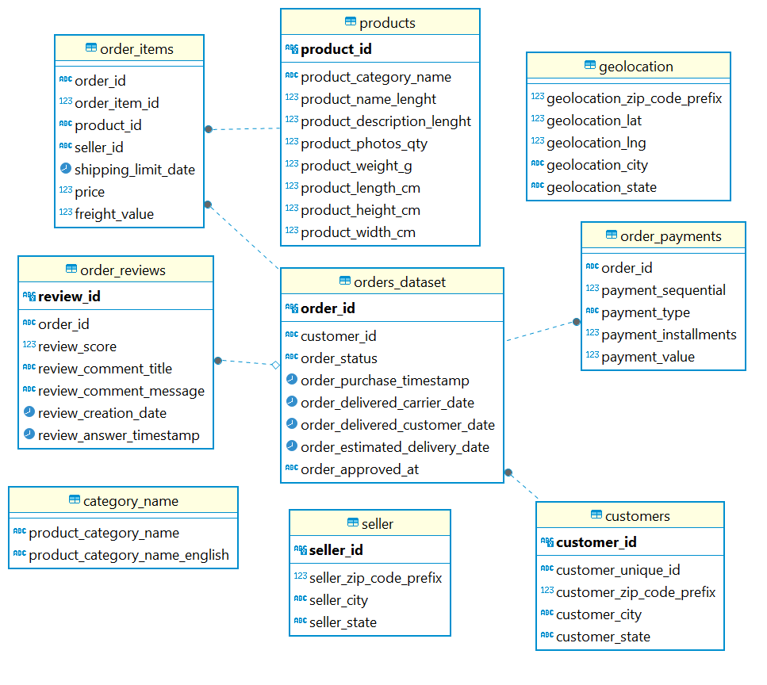
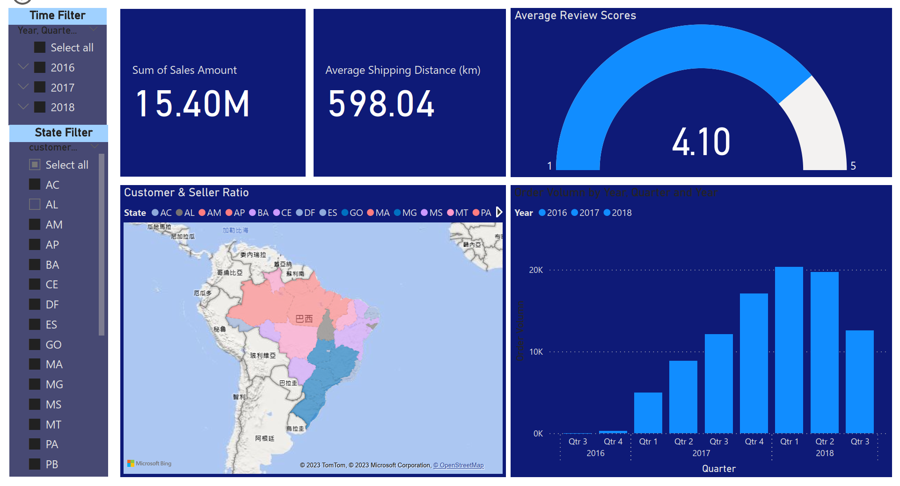
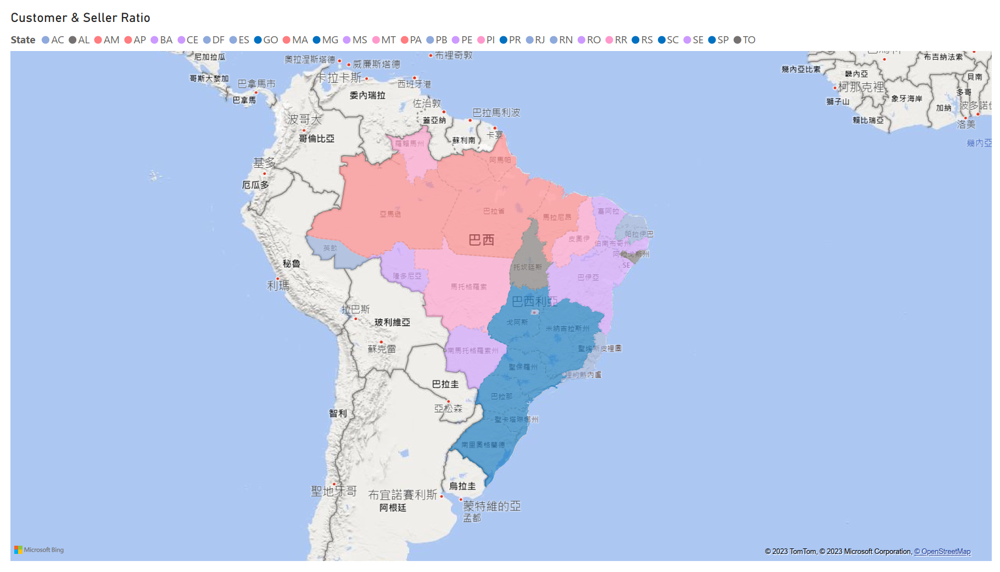
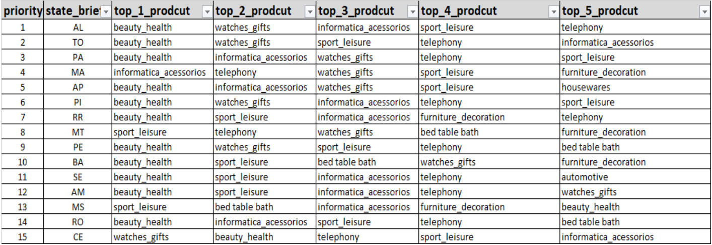

# Brazil E-commerce Olist Business Analysis

## Introduction
Olist is an online retailer in Brazil that provides an open-source dataset containing information on up to 100,000 orders made on their platform. The dataset can be accessed and downloaded from this Google Drive link: https://drive.google.com/file/d/1bLwp3KmwvQHB2ucquErlkayI8yCEvmO9/view. The objective of this analysis is to enhance Olist's business performance, particularly in terms of the Repurchase Rate, by thoroughly exploring the dataset and providing actionable recommendations.

## Data Sources and Used Tools
- Data Sources: Brazilian E-Commerce Public Dataset by Olist
- Used Tools: Python (Pandas, Matplotlib, Numpy, NLTK), PostgreSQL, Power BI

## Local Setup
1. Create and activate a virtual environment:
   - `python3 -m venv venv`
   - `source venv/bin/activate` (macOS/Linux) or `venv\\Scripts\\activate` (Windows)
2. Install dependencies:
   - `pip install -r requirements.txt`
3. Open notebooks in `notebooks/` and run cells from top to bottom.

## Project Structure
```text
olist-analysis/
├── data/
│   ├── raw/                  # source datasets (ignored in git)
│   └── processed/            # generated outputs (tracked)
├── notebooks/
│   ├── customer_seller_ratio.ipynb
│   ├── states_demand_supply.ipynb
│   ├── generate_customer_seller_geolocation.ipynb
│   └── nltk_comments.ipynb
├── reports/                  # final images and BI assets
├── requirements.txt
└── README.md
```

## Recommended Run Order
1. `notebooks/generate_customer_seller_geolocation.ipynb`
2. `notebooks/customer_seller_ratio.ipynb`
3. `notebooks/states_demand_supply.ipynb`
4. `notebooks/nltk_comments.ipynb` (text analysis only)

## Output Files (`data/processed/*.csv`)
These files are generated after running the notebooks:
- `data/processed/order_geolocation_2.csv` from `generate_customer_seller_geolocation.ipynb`
- `data/processed/customer_seller_ratio.csv` from `customer_seller_ratio.ipynb`
- `data/processed/recommend_sales_gap_5.csv` from `states_demand_supply.ipynb`

## Relational Database in PostgreSQL


## Dashboard in Power BI


## Analysis Procedures
### Check the present repurchase rate by SQL query

The result shows that the repurchase rate is approximately 3%, which is significantly low. To identify the reasons, customer comments are assumed to potentially provide some insights.

### Find out the customer's thought by Python (NLTK)
- Data Manipulation: https://colab.research.google.com/drive/1UtqGCFd1Bl-eoI1k0TDz1BfGreERluwN#scrollTo=DrH9oBRMzwmE
- NLTK is used to tokenize over 40,000 customers' comments and filter out the stop words. And it provides a list of frequency of meaningful words. The top ten of the list:
  -  ('product', 15871), ('delivery', 5316), ('arrived', 4937), ('time', 4845), ('good', 4452), ('recommend', 4422), ('received', 4403), ('delivered', 4268), ('deadline', 3075), ('came', 2824)
- Mainly, customers emphasized two things, the product quality and delivery. Since the dataset did not provide enough data for analysing product quality, this will not be the focus in this analysis. The focus will be studying the delivery, especially the shipping distance.

### Find out the shipping distance of orders using Python (Matplotlib, Pandas) and show the result in Power BI
- Data Manipulation: https://colab.research.google.com/drive/1TM_L7MW8UEdJCxUrHS76fPLYsLFGHHAu
- Matplotlib is used to draw a line between acceptable and far distance to demonstrate at which distance level goods need to be delivered between two states.

  - Note: 0 and 1 represent 'order shipping across states' and 'order shipping within a state'
  - It shows most orders are shipped across states when the shipping distance is at 500 km. Thus, within 500 km will be treated as acceptable distance, more than 500 km as too far.
- To show the insight of distance, pandas' DataFrame of distance is imported to Power BI and The distance 

  - Note: Orders with distances greater than or equal to 500 km are represented with blue color (light to dark shade); distances between 500 and 1000 km are represented with pink; distances between 1000 and 2000 km are represented with purple; distances over 2000 km are represented with red.
  - The graph shows that São Paulo State is a central point from which orders gradually expand outward, and transportation distance increases as orders move farther away from this province.
  - The orders with the farthest distances are concentrated in the coastal regions in the upper right corner.
  - This insight suggests that most sellers are located in São Paulo State, while other states have an undesirable sellers-to-customer ratio.

### To validate the insight, find out the customer-to-seller ratio in each state
- Data Manipulation: https://colab.research.google.com/drive/1-W43e9BhS9z20lzE6MomaZuADmQLLw7R#scrollTo=sIZpexocaY6L

  - Note: The color of states is correspond to the graph of shipping distance. Blue is 1 seller: less than 100 customers; purple is between 100 to 200; red is between 200 to 4000.
  - The graph aligns with the graph of shipping distance. Blue areas are concentrated in the lower right corner, while other areas are either purple or red, indicating an unfavorable customers-to-sellers ratio.
  - In conclusion, the orders have long shipping distances because some states have too few sellers to meet local state demand.  

## Recommendations to Olist
- The Recommendations: Encourage more sellers to set up warehouses and store specific product categories in specific states.
  - Recommendation of specific product categories in states with priority:
    - Data Manipulation: https://colab.research.google.com/drive/1EhHwfQQAdkMYV-zB6C2T9HipXWF-vrBP
   
    - The suggested ranking is based on a comparison of the sellers' ratios in each state. States with lower seller ratios are prioritized in the ranking.
    - As for the product recommendations, it involves calculating the difference between the number of items sold and purchased for each product category in each state. The top five product categories with the largest differences are then ranked in descending order
  - To persuade sellers, Olist can set up its own warehouses and sell the suggested products in these states for a period of six months. Olist should gather data during this period to demonstrate the profitability of such a business approach. Sellers would be more incentivized to join the plan when they see the potential for profit
  - The ideal outcome would be customers being able to buy products locally, thus reducing shipping time and costs. This may improve their user experience and encourage them to use Olist more frequently. As a result, the repurchase rate is expected to increase. 

